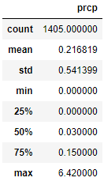

# Surfs Up Weather Analysis

## Project Overview

We are meeting W. Avy utilizing the same climate analysis jupyter notebook file used in a previous challenge. W. Avy is concerned by the amount of precipitation on Oahu since there needs to be enough rain to keep Oahu green but not to the point it affects surfing and ice cream weather as we look to set up a store there. This particular analysis focuses on weather statistics between the month of June and December in order to help better understand whether or not the weather will be favorable. 

## Results

June temperature descriptive statistics:

December temperature descriptive statistics:

As we compare the two tables representing the descriptive statistics of the months of June and December, we observe:
1. The average temperature between the two months is roughly similar with June showing an average of 75 degrees and December showing an average of 71 degrees thus signifying both are warm months despite being in different seasons.
2. Both months have a similar max temperature as well, with June recording 85 degrees as its highest and December recording 83 degrees.
3. Wheras both the average and max temperatures showcased little variance between the two months, we noticed that when it comes to min temperature, we see a greater variance in data: June recroding a low of 64 degrees and December recording a low of 56 degrees thus showcasing December may not be optimal for both ice cream and surfing despite the average temperature being similar to Junes.

## Summary

In summary, both the month of June and December are similar in temperature when it comes to the max and average. December, despite being similar to Junes statistics, still shows greater variance between the min and max temperature, as is evident by the standard deviation of the data. Some additional queries that we could run to determine if Oahu is a viable place to set shop are: precipitation difference between the two months in order to determine which month of the year typically sees more rainfall as well as running a query on the different weather stations around Oahu and analyzing the temperature data between stations to determine which specific location may be more oppurtune.
